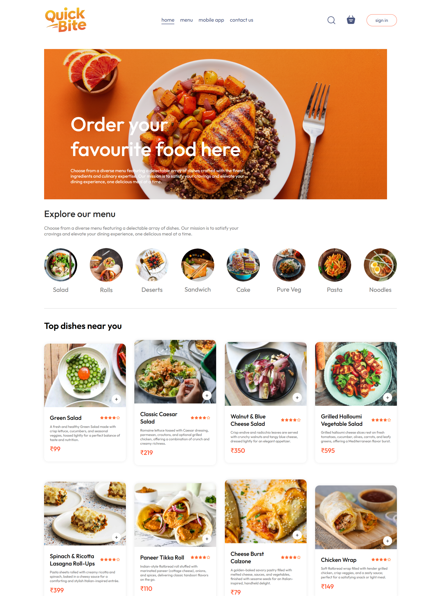

# 🍔 Quick_Bite

A full-stack **Food Delivery Web App** built using **MERN stack** with **Stripe integration**.  
Users can browse menu, add items to cart, place orders, and pay online.  
An **Admin Panel** is available to manage orders and menu items efficiently.

---

## 📛 Badges


---

## 🌐 Live Demo

<p align="left">
  <a href="https://quick-bite-frontend-z2lr.onrender.com" target="_blank">
    
  </a>
</p>

---

## 🖼️ Preview

<table>
  <tr>
    <th>Home Page</th>
    <th>Cart Page</th>
    <th>Checkout Page</th>
    <th>Admin Panel</th>
  </tr>
  <tr>
    <td>
      
    </td>
    <td>
      
    </td>
    <td>
      
    </td>
    <td>
      
    </td>
  </tr>
</table>

---

## ✨ Features

- User authentication & authorization  
- Browse restaurants and food menu  
- Add to cart & checkout flow  
- Online payments with Stripe  
- Order tracking  
- Admin panel for managing orders & menu  
- Responsive UI  

---

## 🧩 Tech Stack


---

## 📁 Project Structure


```
Quick_Bite

├── admin
│ ├── src
│ ├── public
│ └── package.json
├── backend
│ ├── controllers
│ ├── models
│ ├── routes
│ ├── uploads
│ ├── server.js
│ └── package.json
├── frontend
│ ├── src
│ ├── public
│ └── package.json
├── .gitignore
└── README.md
```


## ⚙️ Installation

Follow these steps to run the project locally:

```bash
# Clone the repo
git clone https://github.com/username/Quick_Bite.git

# Go to project folder
cd Quick_Bite

# Install backend dependencies
cd backend
npm install

# Install frontend dependencies
cd ../frontend
npm install

# Install admin panel dependencies
cd ../admin
npm install

# Start backend server
cd ../backend
npm start

# Start frontend
cd ../frontend
npm start

# Start admin panel
cd ../admin
npm start
```


## 🤝 Contributing

Contributions are welcome!

1. Fork the repository

2. Create your feature branch:
    ```
    git checkout -b feature-name
    ```

3. Commit your changes:
    ```
    git commit -m "Add feature"
    ```

4. Push to the branch:
    ```
    git push origin feature-name
    ```

5. Open a Pull Request 🎉
